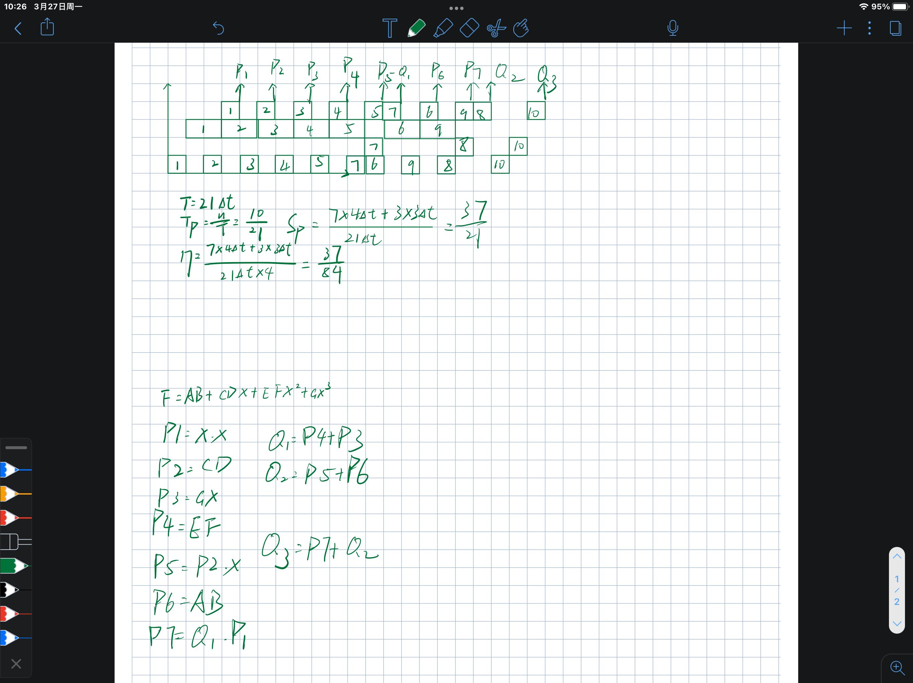

计算机系统中某一功能 A 经过改进增强后，其处理速度是未改进前的 8 倍。改进后，该功能的处理时间仅为整个系统运行时间的 40%。试问改进增强功能 A 后，整个系统获得的加速比是多少？

有一条双功能双输入的流水线，由 4 个功能段组成：S1→S2→S4 连接完成加法；S1→S3→S4 连接完成乘法。设经过 S3 的时间为 2Δt，其余各段时间都为 Δt，延迟和功能切换时间忽略不计。现要在动态工作方式下，用最短时间完成下列计算： F = AB + CDX + EFX2 +GX3。 请画出流水线的时空图，并分析其性能。

在一个5段的流水线处理机上，需要9拍才能完成一个任务，其预约表如下图所示。请写出：
（1）延迟禁止表F  （2）初始冲突向量C  （3）画出流水线状态转移图  （4） 求出最小平均延迟及其对应的调度方案  （5）若按（4）确定的流水线调度方案输入6个任务，求实际吞吐率

阵列机中，0-7号共8个处理单元互连，要求按照（0,5）、（1,4）、（2,7）、（3,6）配对通信。请试着：
（1）写出实现此互连功能的互连函数的一般式。
（2）画出三级立方体网络实现互连函数的互连网络拓扑结构图。并标出各控制开关的状态（直通 or 交叉）

第2题：编译后，有下列程序：

（1）使用FORK和JOIN语句将其改写成可在多处理机上并行执行的程序。

（2）假设有2台处理机，请画出该程序运行的资源时间图（加减最快，乘法次之，除法最慢）

