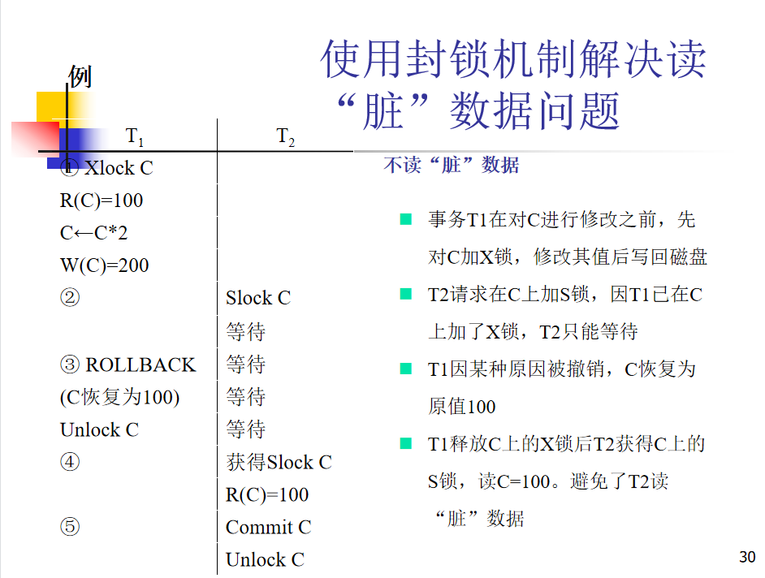

# CH11 并发控制

什么是事务的串行调度？并发调度？
- 串行调度：一个调度中，属于一个事务的所有操作连续执行，称之为串行调度。 
- 并发调度：多个事务同时执行的调度。

如果不加以控制，事务的并发调度可能会产生什么问题？
- 丢失修改（写后写）
	- 两个事务 $T_1$ 和 $T_2$ 读入同一数据并修改，$T_2$ 提交的结果破坏了 $T_1$ 提交的结果，导致 $T_1$ 的修改被丢失。
- 不可重复读（读后写）
	- 指事务 $T_1$ 读取数据后，事务 $T_2$ 执行更新操作，使 $T_1$ 无法再现前一次读取结果。
- 读脏数据（写后读）
	- 指事务 $T_1$ 修改某一数据并将其写回磁盘，事务 $T_2$ 读取同一数据后，$T_1$ 由于某种原因被撤销，这时被 $T_1$ 修改过的数据恢复原值， $T_2$ 读到的数据就与数据库中的数据不一致，则 $T_2$ 读到的数据就为脏数据。

数据的不一致性：
- 并发操作破坏事物的隔离性

简述封锁机制的工作原理；
- 封锁就是事务 $T$ 在对某个数据对象（例如表、记录等）操作之前，先向系统发出请求，对其加锁。
- 加锁后事务 $T$ 就对该数据对象有了一定的控制，在事务T释放它的锁之前，其它的事务不能更新此数据对象。

锁的类型：
- 排他锁（X锁）-写锁
- 共享锁（S锁）-读锁

引入封锁机制，如何解决上述3个问题？

死锁预防
- 一次封锁法
	- 要求每个事务必须一次将所有要使用的数据全部加锁，否则就不能继续执行
	- 存在的问题
		- 降低系统并发度
		- 难于事先精确确定封锁对象
- 顺序封锁法
	- 顺序封锁法是预先对数据对象规定一个封锁顺序，所有事务都按这个顺序实行封锁。
	- 顺序封锁法存在的问题
		- 维护成本：数据库系统中封锁的数据对象极多，并且在不断地变化。
		- 难以实现：很难事先确定每一个事务要封锁哪些对象

死锁诊断、死锁的判别；
- 超时法
	- 如果一个事务的等待时间超过了规定的时限，就认为发生了死锁
	- 优点：实现简单
	- 缺点
		- 有可能误判死锁
		- 时限若设置得太长，死锁发生后不能及时发现
- 事务等待图法
	- 用事务等待图动态反映所有事务的等待情况
		- 事务等待图是一个有向图G=(T，U)
		- T为结点的集合，每个结点表示正运行的事务
		- U为边的集合，每条边表示事务等待的情况
		- 若T1等待T2，则T1，T2之间划一条有向边，从T1指向T2

冲突操作对；
- 指不同事物对同一个数据的读写操作和写写操作。

可串行化调度：
- 多个事物并发执行的结果与按某依次序串行执行的结果相同

冲突可串行化：
- 在保证冲突操作的次序不变的情况下交换两个事物不冲突操作的次序得到的调度是串行调度

事务优先图；

等价的串行调度；

2PL协议；
- 指所有事务必须分两个阶段对数据项加锁和解锁 
	- 在对任何数据进行读、写操作之前，事务首先要获得对该数据的封锁
	- 在释放一个封锁之后，事务不再申请和获得任何其他封锁
- 两个阶段
  - 扩展阶段
  -  收缩阶段
- 遵循两段锁协议也可能死锁
  
多粒度封锁协议。
- 在一个系统中同时支持多种封锁粒度供不同的事务选择
- 选择封锁粒度
	- 同时考虑封锁开销和并发度两个因素，适当选择封锁粒度
		- 需要处理多个关系的大量元组的用户事务：以数据库为封锁单位
		- 需要处理大量元组的用户事务：以关系为封锁单元
		- 只处理少量元组的用户事务：以元组为封锁单位

在多粒度封锁中一个数据对象可能以两种方式封锁：显式封锁和隐式封锁

意向锁；